# System Architecture

## Table of Contents
1. [Architecture Overview](#architecture-overview)
2. [System Context Diagram](#system-context-diagram)
3. [Container Architecture](#container-architecture)
4. [Component Architecture](#component-architecture)
5. [Deployment Architecture](#deployment-architecture)
6. [Infrastructure Architecture](#infrastructure-architecture)
7. [Security Architecture](#security-architecture)
8. [Data Flow Architecture](#data-flow-architecture)
9. [Scalability Design](#scalability-design)
10. [Design Decisions](#design-decisions)

## Architecture Overview

The To-Do List Web Application follows a **cloud-native, microservices-based architecture** deployed on AWS using Kubernetes. The system is designed with scalability, maintainability, and DevOps best practices in mind.

### Architectural Principles
- **Separation of Concerns**: Clear boundaries between presentation, business logic, and data layers
- **Containerization**: All components packaged as Docker containers
- **Cloud-Native**: Designed for Kubernetes orchestration
- **DevOps Integration**: Complete CI/CD pipeline with automated testing and deployment
- **Security by Design**: Multiple security scanning and validation layers
- **Infrastructure as Code**: Reproducible infrastructure using Terraform

## System Context Diagram

```mermaid
graph TB
    Users[👥 End Users] --> LB[🔧 AWS Load Balancer]
    DevTeam[👩‍💻 Development Team] --> Jenkins[🔧 Jenkins CI/CD]
    Jenkins --> ECR[📦 AWS ECR]
    Jenkins --> SonarQube[🔍 SonarQube]
    Jenkins --> GitHub[📚 GitHub Repository]
    
    LB --> K8s[☸️ Kubernetes Cluster]
    
    subgraph "AWS Cloud"
        ECR
        K8s
        LB
        subgraph "EKS Cluster"
            Frontend[⚛️ React Frontend]
            Backend[🚀 Node.js API]
            Database[🗄️ MongoDB]
        end
    end
    
    K8s --> Frontend
    K8s --> Backend
    K8s --> Database
    Backend --> Database
    Frontend --> Backend
```



### External Dependencies
- **GitHub**: Source code repository and version control
- **AWS ECR**: Container image registry
- **Jenkins**: CI/CD automation server
- **SonarQube**: Code quality and security analysis
- **Trivy**: Container security scanning
- **Terraform**: Infrastructure provisioning

## Container Architecture

### High-Level Container View

```mermaid
graph LR
    subgraph "User Layer"
        Browser[🌐 Web Browser]
    end
    
    subgraph "Load Balancer Layer"
        ALB[⚖️ Application Load Balancer]
    end
    
    subgraph "Application Layer"
        Frontend[📱 Frontend Container<br/>React App<br/>Port: 3000]
        Backend[🔧 Backend Container<br/>Node.js API<br/>Port: 3500]
    end
    
    subgraph "Data Layer"
        MongoDB[🗃️ Database Container<br/>MongoDB<br/>Port: 27017]
        PV[💾 Persistent Volume<br/>Data Storage]
    end
    
    Browser --> ALB
    ALB --> Frontend
    Frontend --> Backend
    Backend --> MongoDB
    MongoDB --> PV
```



### Container Specifications

#### Frontend Container
```yaml
Container: todo-frontend
Base Image: node:14
Port: 3000
Resources:
  Memory: 128Mi - 256Mi
  CPU: 100m - 200m
Health Checks:
  - HTTP GET / (port 3000)
Environment Variables:
  - REACT_APP_API_URL
```

#### Backend Container
```yaml
Container: todo-backend
Base Image: node:14
Port: 3500
Resources:
  Memory: 256Mi - 512Mi
  CPU: 200m - 400m
Health Checks:
  - HTTP GET /healthz (port 3500)
  - HTTP GET /ready (port 3500)
  - HTTP GET /started (port 3500)
Environment Variables:
  - MONGO_CONN_STR
  - MONGO_USERNAME
  - MONGO_PASSWORD
  - USE_DB_AUTH
  - PORT
```

#### Database Container
```yaml
Container: mongodb
Base Image: mongo:latest
Port: 27017
Resources:
  Memory: 512Mi - 1Gi
  CPU: 500m - 1000m
Persistent Storage:
  - Volume: 1Gi
  - Path: /data/db
Environment Variables:
  - MONGO_INITDB_ROOT_USERNAME
  - MONGO_INITDB_ROOT_PASSWORD
```

## Component Architecture

### Frontend Architecture


#### Component Responsibilities
- **App Component**: Main UI container, renders Material-UI components
- **Tasks Component**: Business logic, state management, event handling
- **API Services**: HTTP communication, error handling, data transformation
- **Material-UI**: Pre-built React components for consistent UI
- **Axios**: HTTP client for API communication

### Backend Architecture


#### Component Responsibilities
- **Express Server**: HTTP server, middleware configuration, routing
- **Task Routes**: RESTful API endpoints, request/response handling
- **Task Model**: Data schema definition, validation, database operations
- **Database Connection**: MongoDB connection management, authentication
- **Middleware**: Cross-cutting concerns (CORS, parsing, health checks)

## Deployment Architecture

### Kubernetes Deployment


### Deployment Strategy
- **Rolling Updates**: Zero-downtime deployments
- **Replica Sets**: High availability with multiple instances
- **Health Checks**: Automatic pod restart on failures
- **Resource Limits**: Controlled resource consumption
- **Horizontal Pod Autoscaling**: Automatic scaling based on metrics

### Kubernetes Resources

#### Frontend Deployment
```yaml
apiVersion: apps/v1
kind: Deployment
metadata:
  name: frontend
  namespace: three-tier
spec:
  replicas: 2
  strategy:
    type: RollingUpdate
    rollingUpdate:
      maxSurge: 1
      maxUnavailable: 0
```

#### Backend Deployment
```yaml
apiVersion: apps/v1
kind: Deployment
metadata:
  name: api
  namespace: three-tier
spec:
  replicas: 2
  strategy:
    type: RollingUpdate
    rollingUpdate:
      maxSurge: 1
      maxUnavailable: 25%
```

#### Database Deployment
```yaml
apiVersion: apps/v1
kind: Deployment
metadata:
  name: mongodb
  namespace: three-tier
spec:
  replicas: 1
  strategy:
    type: Recreate
```

## Infrastructure Architecture

### AWS Infrastructure


### Terraform Infrastructure Components

#### Core Infrastructure
```hcl
# VPC and Networking
module "vpc" {
  source = "./modules/vpc"
  cidr_block = "10.0.0.0/16"
}

# EKS Cluster
module "eks" {
  source = "./modules/eks"
  vpc_id = module.vpc.vpc_id
  subnet_ids = module.vpc.private_subnet_ids
}

# Jenkins Server
module "jenkins" {
  source = "./modules/ec2"
  instance_type = "t3.medium"
  subnet_id = module.vpc.public_subnet_id
}
```

#### Security Groups
- **Jenkins SG**: SSH (22), HTTP (8080), HTTPS (443)
- **EKS SG**: Kubernetes API (443), Node communication
- **ALB SG**: HTTP (80), HTTPS (443)

## Security Architecture

### Security Layers


### Security Controls

#### Code Security
- **Static Analysis**: SonarQube code quality and security scanning
- **Dependency Scanning**: OWASP dependency vulnerability checks
- **Container Scanning**: Trivy image vulnerability assessment
- **Secret Management**: Kubernetes secrets for sensitive data

#### Infrastructure Security
- **Network Isolation**: VPC with public/private subnets
- **Access Control**: IAM roles with least privilege
- **Encryption**: EBS volume encryption, TLS for data in transit
- **Monitoring**: CloudWatch logging and alerting

#### Runtime Security
- **Pod Security**: Security contexts and policies
- **Network Policies**: Kubernetes network segmentation
- **Resource Limits**: CPU and memory constraints
- **Health Monitoring**: Continuous health checks

## Data Flow Architecture

### Request Flow


### Data Flow Patterns

#### Create Task Flow
1. User enters task in frontend form
2. Frontend validates input locally
3. Frontend sends POST request to backend API
4. Backend validates request and creates task in MongoDB
5. Backend returns created task with ID
6. Frontend updates local state and UI

#### Update Task Flow
1. User clicks task completion checkbox
2. Frontend optimistically updates UI
3. Frontend sends PUT request to backend API
4. Backend updates task in MongoDB
5. On failure, frontend reverts UI state

#### Delete Task Flow
1. User clicks delete button
2. Frontend removes task from UI
3. Frontend sends DELETE request to backend API
4. Backend removes task from MongoDB
5. On failure, frontend restores task in UI

## Scalability Design

### Horizontal Scaling


### Scaling Strategies

#### Frontend Scaling
- **Stateless Design**: No server-side sessions
- **CDN Integration**: Static asset caching
- **Load Balancing**: Round-robin distribution
- **Auto-scaling**: CPU and memory-based scaling

#### Backend Scaling
- **Stateless API**: No server-side state storage
- **Connection Pooling**: MongoDB connection optimization
- **Caching Strategy**: In-memory and distributed caching
- **Database Scaling**: Read replicas and sharding

#### Database Scaling
- **Vertical Scaling**: Increase pod resources
- **Read Replicas**: Separate read and write operations
- **Sharding**: Horizontal data partitioning
- **Backup Strategy**: Regular data backups

### Performance Optimization

#### Frontend Optimization
- **Code Splitting**: Lazy loading of components
- **Bundle Optimization**: Webpack optimization
- **Asset Compression**: Gzip compression
- **Caching**: Browser and CDN caching

#### Backend Optimization
- **Database Indexing**: Optimized query performance
- **Connection Pooling**: Efficient database connections
- **Response Compression**: Reduced payload size
- **Async Processing**: Non-blocking operations

## Design Decisions

### Technology Choices

#### Why React?
- **Component-based**: Reusable UI components
- **Virtual DOM**: Efficient rendering
- **Large Ecosystem**: Extensive library support
- **Developer Experience**: Excellent tooling

#### Why Node.js?
- **JavaScript Everywhere**: Unified language stack
- **Async I/O**: Non-blocking operations
- **NPM Ecosystem**: Rich package ecosystem
- **Performance**: V8 engine optimization

#### Why MongoDB?
- **Document Storage**: Flexible schema design
- **JSON Integration**: Native JavaScript object storage
- **Horizontal Scaling**: Built-in sharding support
- **Developer Friendly**: Easy to use and maintain

#### Why Kubernetes?
- **Container Orchestration**: Automated deployment and scaling
- **Service Discovery**: Built-in load balancing
- **Rolling Updates**: Zero-downtime deployments
- **Resource Management**: Efficient resource utilization

### Architectural Trade-offs

#### Microservices vs Monolith
**Chosen**: Microservices
- **Pros**: Independent scaling, technology diversity, fault isolation
- **Cons**: Complexity, network overhead, distributed system challenges

#### Database per Service vs Shared Database
**Chosen**: Shared Database (for simplicity)
- **Pros**: Simplified data management, ACID transactions
- **Cons**: Coupling between services, scaling limitations

#### Synchronous vs Asynchronous Communication
**Chosen**: Synchronous HTTP
- **Pros**: Simpler error handling, immediate feedback
- **Cons**: Blocking operations, potential cascading failures

---

This architecture documentation provides a comprehensive view of the system design, from high-level concepts to detailed implementation decisions. It serves as a blueprint for development, deployment, and maintenance of the To-Do List Web Application.