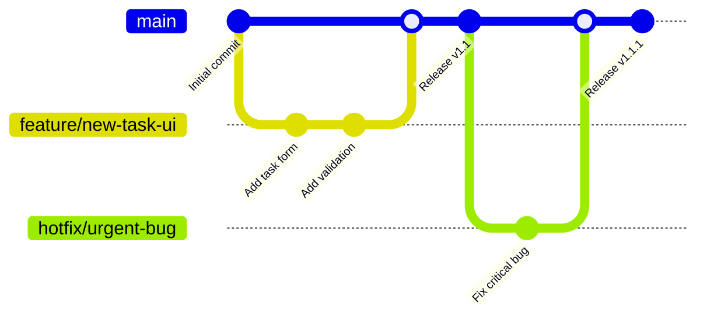
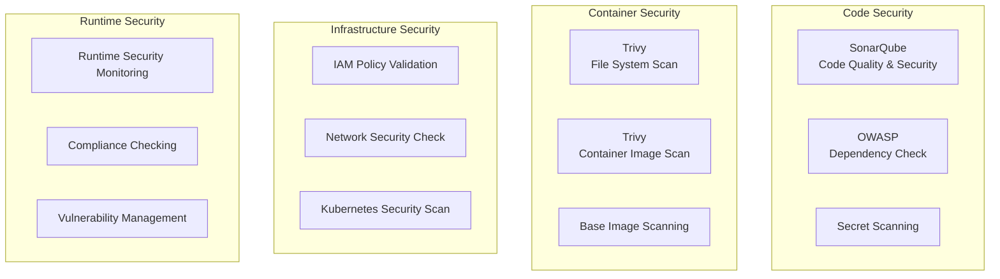
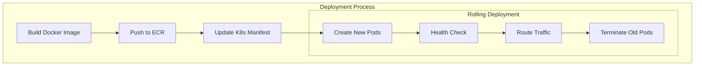
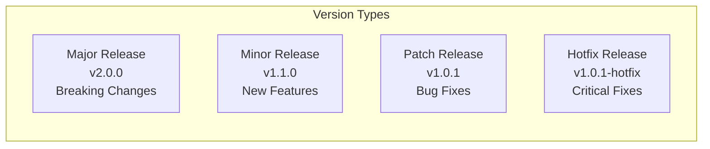

# Development Workflow and CI/CD Pipeline

## Table of Contents
1. [Development Workflow](#development-workflow)
2. [CI/CD Pipeline Overview](#cicd-pipeline-overview)
3. [Jenkins Pipeline Details](#jenkins-pipeline-details)
4. [GitOps Workflow](#gitops-workflow)
5. [Security Scanning Workflow](#security-scanning-workflow)
6. [Deployment Workflow](#deployment-workflow)
7. [Monitoring and Alerting Workflow](#monitoring-and-alerting-workflow)
8. [Troubleshooting Workflow](#troubleshooting-workflow)
9. [Release Management](#release-management)
10. [Best Practices](#best-practices)

## Development Workflow

### Git Workflow



### Development Process

#### 1. Feature Development
```bash
# Create feature branch
git checkout -b feature/task-priority
git push -u origin feature/task-priority

# Develop feature
# Make changes to code
git add .
git commit -m "feat: add task priority functionality"

# Push changes
git push origin feature/task-priority

# Create Pull Request
# Code review process
# Automated testing via CI/CD

# Merge to main
git checkout main
git pull origin main
git merge feature/task-priority
git push origin main
```

#### 2. Local Development Setup
```bash
# Clone repository
git clone https://github.com/krnmaheshwari09/To-do-list-webApp.git
cd To-do-list-webApp

# Backend setup
cd Application-Code/backend
npm install
export MONGO_CONN_STR="mongodb://localhost:27017/todo"
npm start

# Frontend setup (new terminal)
cd Application-Code/frontend
npm install
npm start

# Verify application
# Frontend: http://localhost:3000
# Backend: http://localhost:3500
```

#### 3. Testing Workflow
```bash
# Run frontend tests
cd Application-Code/frontend
npm test

# Run backend tests
cd Application-Code/backend
npm test

# Run integration tests
npm run test:integration

# Run e2e tests
npm run test:e2e
```

## CI/CD Pipeline Overview

### Pipeline Architecture

```mermaid
graph TB
    subgraph "Source Control"
        GitHub[📚 GitHub Repository]
        Webhook[🔗 Webhook Trigger]
    end
    
    subgraph "CI/CD Pipeline"
        Jenkins[🔧 Jenkins Master]
        
        subgraph "Build Stage"
            Checkout[📥 Code Checkout]
            SonarQube[🔍 SonarQube Analysis]
            OWASP[🛡️ OWASP Scan]
            TrivyFS[🔒 Trivy File Scan]
        end
        
        subgraph "Package Stage"
            DockerBuild[🐳 Docker Build]
            ECRPush[📦 ECR Push]
            TrivyImage[🔒 Trivy Image Scan]
        end
        
        subgraph "Deploy Stage"
            GitOps[📝 GitOps Update]
            K8sDeploy[☸️ K8s Deployment]
        end
    end
    
    subgraph "Target Environment"
        EKS[☸️ EKS Cluster]
        ArgoCD[🔄 ArgoCD (Optional)]
    end
    
    GitHub --> Webhook
    Webhook --> Jenkins
    Jenkins --> Checkout
    Checkout --> SonarQube
    SonarQube --> OWASP
    OWASP --> TrivyFS
    TrivyFS --> DockerBuild
    DockerBuild --> ECRPush
    ECRPush --> TrivyImage
    TrivyImage --> GitOps
    GitOps --> K8sDeploy
    K8sDeploy --> EKS
```

### Pipeline Triggers
- **Automatic**: Git push to main branch
- **Manual**: Jenkins job trigger
- **Scheduled**: Nightly security scans
- **Pull Request**: Automated testing on PR creation

## Jenkins Pipeline Details

### Backend Pipeline (`Jenkinsfile-Backend`)

```groovy
pipeline {
    agent any 
    tools {
        nodejs 'nodejs'
    }
    environment  {
        SCANNER_HOME=tool 'sonar-scanner'
        AWS_ACCOUNT_ID = credentials('ACCOUNT_ID')
        AWS_ECR_REPO_NAME = credentials('ECR_REPO2')
        AWS_DEFAULT_REGION = 'us-east-1'
        REPOSITORY_URI = "${AWS_ACCOUNT_ID}.dkr.ecr.${AWS_DEFAULT_REGION}.amazonaws.com/"
    }
    stages {
        stage('Cleaning Workspace') { ... }
        stage('Checkout from Git') { ... }
        stage('Sonarqube Analysis') { ... }
        stage('Quality Check') { ... }
        stage('OWASP Dependency-Check Scan') { ... }
        stage('Trivy File Scan') { ... }
        stage("Docker Image Build") { ... }
        stage("ECR Image Pushing") { ... }
        stage("TRIVY Image Scan") { ... }
        stage('Update Deployment file') { ... }
    }
}
```

#### Stage Details

**1. Workspace Cleanup**
- Removes previous build artifacts
- Ensures clean build environment

**2. Source Code Checkout**
- Clones latest code from GitHub
- Uses Git credentials for private repositories

**3. SonarQube Analysis**
- Static code analysis for quality and security
- Generates code coverage reports
- Identifies code smells and vulnerabilities

**4. Quality Gate Check**
- Waits for SonarQube quality gate result
- Fails pipeline if quality standards not met
- Configurable quality gate thresholds

**5. OWASP Dependency Check**
- Scans for known vulnerabilities in dependencies
- Generates vulnerability report
- Blocks deployment of high-risk vulnerabilities

**6. Trivy File System Scan**
- Scans source code for security issues
- Checks for hardcoded secrets
- Validates file permissions and configurations

**7. Docker Image Build**
- Builds container image using Dockerfile
- Tags image with build number
- Optimizes image layers for efficiency

**8. ECR Image Push**
- Authenticates with AWS ECR
- Pushes Docker image to registry
- Tags image with build number and latest

**9. Trivy Image Scan**
- Scans container image for vulnerabilities
- Checks base image security
- Validates image configuration

**10. GitOps Deployment Update**
- Updates Kubernetes manifest files
- Commits changes to Git repository
- Triggers deployment through GitOps

### Frontend Pipeline (`Jenkinsfile-Frontend`)

Similar structure to backend pipeline with frontend-specific configurations:
- Node.js build process
- React application building
- Static asset optimization
- Frontend-specific security scanning

### Pipeline Configuration

#### Jenkins Credentials
```yaml
Credentials Required:
- ACCOUNT_ID: AWS Account ID
- ECR_REPO1: Frontend ECR repository name
- ECR_REPO2: Backend ECR repository name
- GITHUB: GitHub access token
- sonar-token: SonarQube authentication token
```

#### Tools Configuration
```yaml
Tools in Jenkins:
- nodejs: Node.js installation
- sonar-scanner: SonarQube scanner
- DP-Check: OWASP Dependency Check
```

## GitOps Workflow

### GitOps Principles

```mermaid
graph LR
    subgraph "Source Code Repo"
        AppCode[Application Code]
        Pipeline[CI/CD Pipeline]
    end
    
    subgraph "Config Repo"
        K8sManifests[Kubernetes Manifests]
        GitCommit[Git Commit]
    end
    
    subgraph "Deployment"
        GitOpsAgent[GitOps Agent<br/>(ArgoCD/Flux)]
        K8sCluster[Kubernetes Cluster]
    end
    
    AppCode --> Pipeline
    Pipeline --> K8sManifests
    K8sManifests --> GitCommit
    GitCommit --> GitOpsAgent
    GitOpsAgent --> K8sCluster
```

### GitOps Process Flow

#### 1. Manifest Update Process
```bash
# Pipeline updates manifest with new image tag
sed -i "s/${AWS_ECR_REPO_NAME}:${OLD_TAG}/${AWS_ECR_REPO_NAME}:${BUILD_NUMBER}/" deployment.yaml

# Commit changes
git add deployment.yaml
git commit -m "Update deployment Image to version ${BUILD_NUMBER}"
git push origin main
```

#### 2. Deployment Reconciliation
- ArgoCD/Flux monitors Git repository
- Detects changes in Kubernetes manifests
- Applies changes to Kubernetes cluster
- Maintains desired state consistency

#### 3. Rollback Process
```bash
# Revert to previous commit
git revert HEAD

# GitOps agent automatically rolls back deployment
kubectl rollout undo deployment/api -n three-tier
```

## Security Scanning Workflow

### Multi-Layer Security Scanning



### Security Scan Details

#### SonarQube Analysis
```yaml
Configuration:
- Quality Gate: Sonar Way (default)
- Coverage Threshold: 80%
- Duplicated Lines: < 3%
- Maintainability Rating: A
- Reliability Rating: A
- Security Rating: A
```

#### OWASP Dependency Check
```yaml
Scan Scope:
- NPM packages (package.json)
- Known vulnerability databases
- CVE database updates
- National Vulnerability Database (NVD)

Severity Levels:
- Critical: Block deployment
- High: Review required
- Medium: Monitor and plan fix
- Low: Informational
```

#### Trivy Scanning
```yaml
File System Scan:
- Configuration files
- Secrets detection
- License compliance
- File permissions

Image Scan:
- Operating system packages
- Application dependencies
- Base image vulnerabilities
- Configuration issues
```

## Deployment Workflow

### Deployment Strategy



### Deployment Environments

#### Development Environment
```yaml
Environment: development
Namespace: three-tier-dev
Replicas: 1
Resources: Minimal
Auto-scaling: Disabled
Monitoring: Basic
```

#### Staging Environment
```yaml
Environment: staging
Namespace: three-tier-staging
Replicas: 2
Resources: Production-like
Auto-scaling: Enabled
Monitoring: Full
```

#### Production Environment
```yaml
Environment: production
Namespace: three-tier
Replicas: 3+
Resources: Optimized
Auto-scaling: Enabled
Monitoring: Comprehensive
Backup: Enabled
```

### Health Check Strategy

#### Kubernetes Probes
```yaml
livenessProbe:
  httpGet:
    path: /healthz
    port: 3500
  initialDelaySeconds: 2
  periodSeconds: 5

readinessProbe:
  httpGet:
    path: /ready
    port: 3500
  initialDelaySeconds: 5
  periodSeconds: 5

startupProbe:
  httpGet:
    path: /started
    port: 3500
  initialDelaySeconds: 0
  periodSeconds: 10
  failureThreshold: 30
```

#### Health Check Endpoints
- **`/healthz`**: Basic server health
- **`/ready`**: Database connectivity check
- **`/started`**: Startup completion confirmation

## Monitoring and Alerting Workflow

### Monitoring Stack

```mermaid
graph TB
    subgraph "Data Collection"
        Apps[Applications]
        K8s[Kubernetes Metrics]
        Infra[Infrastructure Metrics]
    end
    
    subgraph "Metrics Storage"
        CloudWatch[AWS CloudWatch]
        Prometheus[Prometheus<br/>(Optional)]
    end
    
    subgraph "Visualization"
        Grafana[Grafana Dashboards]
        CloudWatchDashboard[CloudWatch Dashboard]
    end
    
    subgraph "Alerting"
        CloudWatchAlarms[CloudWatch Alarms]
        SNS[SNS Notifications]
        Slack[Slack Integration]
    end
    
    Apps --> CloudWatch
    K8s --> CloudWatch
    Infra --> CloudWatch
    CloudWatch --> CloudWatchDashboard
    CloudWatch --> CloudWatchAlarms
    CloudWatchAlarms --> SNS
    SNS --> Slack
```

### Alert Conditions

#### Application Alerts
```yaml
High Error Rate:
  Threshold: > 5% error rate
  Duration: 5 minutes
  Severity: Warning

Service Unavailable:
  Threshold: Health check failures
  Duration: 2 minutes
  Severity: Critical

High Response Time:
  Threshold: > 1 second average
  Duration: 5 minutes
  Severity: Warning
```

#### Infrastructure Alerts
```yaml
High CPU Usage:
  Threshold: > 80%
  Duration: 10 minutes
  Severity: Warning

High Memory Usage:
  Threshold: > 85%
  Duration: 5 minutes
  Severity: Warning

Pod Crash Loop:
  Threshold: > 3 restarts in 10 minutes
  Duration: Immediate
  Severity: Critical
```

## Troubleshooting Workflow

### Common Issues and Solutions

#### Pipeline Failures

**SonarQube Quality Gate Failure**
```bash
# Check SonarQube report
# Fix code quality issues
# Re-run pipeline

# Common fixes:
- Increase test coverage
- Fix code duplications
- Resolve security hotspots
- Address maintainability issues
```

**Docker Build Failure**
```bash
# Check Dockerfile syntax
# Verify base image availability
# Check build context size

# Debug build:
docker build -t debug-image ./Application-Code/backend
docker run -it debug-image /bin/bash
```

**ECR Push Failure**
```bash
# Check AWS credentials
aws sts get-caller-identity

# Login to ECR
aws ecr get-login-password --region us-east-1 | docker login --username AWS --password-stdin <account>.dkr.ecr.us-east-1.amazonaws.com

# Check repository exists
aws ecr describe-repositories --repository-names backend
```

#### Deployment Issues

**Pod Not Starting**
```bash
# Check pod status
kubectl get pods -n three-tier

# Check pod logs
kubectl logs -f deployment/api -n three-tier

# Describe pod for events
kubectl describe pod <pod-name> -n three-tier

# Check resource constraints
kubectl top pods -n three-tier
```

**Service Connectivity**
```bash
# Test service connectivity
kubectl exec -it <pod-name> -n three-tier -- curl http://mongodb-svc:27017

# Check service endpoints
kubectl get endpoints -n three-tier

# Check network policies
kubectl get networkpolicies -n three-tier
```

### Debug Commands

#### Application Debugging
```bash
# Backend logs
kubectl logs -f deployment/api -n three-tier

# Frontend logs
kubectl logs -f deployment/frontend -n three-tier

# Database logs
kubectl logs -f deployment/mongodb -n three-tier

# Live debugging
kubectl exec -it deployment/api -n three-tier -- /bin/bash
```

#### Infrastructure Debugging
```bash
# Cluster status
kubectl cluster-info

# Node status
kubectl get nodes -o wide

# Resource usage
kubectl top nodes
kubectl top pods -A

# Events
kubectl get events --sort-by=.metadata.creationTimestamp
```

## Release Management

### Versioning Strategy



### Release Process

#### 1. Pre-Release Checklist
- [ ] All tests passing
- [ ] Security scans clean
- [ ] Documentation updated
- [ ] Change log prepared
- [ ] Staging deployment verified

#### 2. Release Deployment
```bash
# Tag release
git tag -a v1.1.0 -m "Release version 1.1.0"
git push origin v1.1.0

# Deploy to production
kubectl apply -f Kubernetes-Manifests-file/

# Verify deployment
kubectl rollout status deployment/api -n three-tier
kubectl rollout status deployment/frontend -n three-tier
```

#### 3. Post-Release Verification
- [ ] Health checks passing
- [ ] Monitoring dashboards normal
- [ ] User acceptance testing
- [ ] Performance metrics within SLA

### Rollback Strategy

#### Automated Rollback
```bash
# Kubernetes rollback
kubectl rollout undo deployment/api -n three-tier

# GitOps rollback
git revert <commit-hash>
git push origin main
```

#### Database Rollback
```bash
# Backup before deployment
kubectl exec deployment/mongodb -n three-tier -- mongodump --out /backup

# Restore if needed
kubectl exec deployment/mongodb -n three-tier -- mongorestore /backup
```

## Best Practices

### Development Best Practices
- **Commit Messages**: Use conventional commits (feat:, fix:, docs:)
- **Branch Protection**: Require PR reviews and status checks
- **Code Review**: Mandatory peer review for all changes
- **Testing**: Minimum 80% code coverage requirement

### CI/CD Best Practices
- **Pipeline as Code**: Store Jenkins pipelines in version control
- **Fail Fast**: Stop pipeline on first failure
- **Parallel Execution**: Run independent stages in parallel
- **Artifact Management**: Store build artifacts for traceability

### Security Best Practices
- **Least Privilege**: Minimal required permissions
- **Secret Management**: Never store secrets in code
- **Regular Updates**: Keep dependencies up to date
- **Security Scanning**: Multiple layers of security validation

### Deployment Best Practices
- **Blue-Green Deployment**: Zero-downtime deployments
- **Health Checks**: Comprehensive health monitoring
- **Resource Limits**: Prevent resource exhaustion
- **Monitoring**: Comprehensive observability stack

---

This workflow documentation provides a complete guide for developing, testing, and deploying the To-Do List Web Application using modern DevOps practices and CI/CD pipelines.